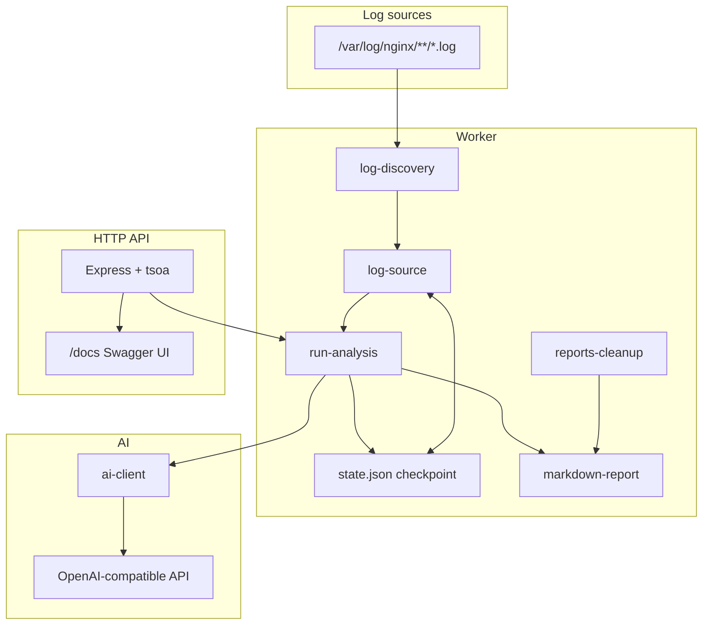

# 🛡️ Log Assistant Bot

> **Documentation language:** [🇷🇺 Русский](./README.md) | [🇬🇧 English](./README.en.md)


Automated **nginx security log assistant** powered by an OpenAI-compatible AI API 🤖. The bot incrementally reads new log bytes from the filesystem, sends them for security analysis, and writes structured Markdown reports.

Designed to run on a server (including Docker) on a cron schedule or on demand via CLI/API.

---

## 📑 Table of Contents

- [What it does](#what-it-does)
- [Architecture](#architecture)
- [Requirements](#requirements)
- [Project Structure](#project-structure)
- [Installation](#installation)
- [Configuration](#configuration)
- [Running the Worker (CLI)](#running-the-worker-cli)
- [Docker Deployment](#docker-deployment)
- [HTTP API](#http-api)
- [Reports](#reports)
- [Checkpoint State Files](#checkpoint-state-files)
- [AI Integration](#ai-integration)
- [Limits and Concurrency](#limits-and-concurrency)
- [Security Notes](#security-notes)
- [Troubleshooting](#troubleshooting)
- [License](#license)

---

## 🎯 What it does

1. 🔍 **Discovers log files** — recursively walks `NGINX_LOG_ROOT` and collects all `*.log` files (including nested vhost directories and `archived/` folders).
2. 📖 **Reads incrementally** — for each file, reads only bytes added since the last run using a JSON checkpoint (offset + inode). Handles log rotation (inode change or size shrink resets the checkpoint).
3. 🏷️ **Labels lines** — each log line is prefixed with a relative path tag, e.g. `[domen.ru/access.log] 1.2.3.4 - - [...]`.
4. 🤖 **Sends to AI** — raw lines are passed to an OpenAI-compatible `/chat/completions` endpoint with a strict JSON schema for structured security findings.
5. 📝 **Writes a report** — a Markdown file `security-report-<timestamp>.md` is saved to `REPORTS_DIR`; a short summary is printed to stdout.
6. ⏰ **Schedules runs** — in default mode, analysis runs immediately on startup and then on a cron schedule (`CRON_SCHEDULE`, default every 2 hours).
7. 🧹 **Cleans up old reports** — deletes reports older than `REPORT_RETENTION_DAYS` (after each analysis or on a separate cron).

### 🔄 Analysis Modes

| Mode | CLI Flag | API Endpoint | Checkpoint File | Behavior |
|------|----------|--------------|-----------------|----------|
| **Main (incremental)** | `--once` / default cron | `POST /analyze/once` | `STATE_FILE_PATH` | Only new bytes since last run |
| **Away (separate incremental)** | `--away` | `POST /analyze/away` | `AWAY_STATE_FILE_PATH` | Same incremental logic, independent checkpoint — useful for manual/on-demand runs without affecting the main schedule |

Both modes use the same pipeline (`runOneShotAnalysis`); only the checkpoint file differs.

> 💡 When no new log lines are found, a report is still generated with `suspicious: false` and a low-risk summary.

---

## 🏗️ Architecture



### 📦 Modules

| Path | Purpose |
|------|---------|
| `src/core/cli.ts` | CLI entry: `--once`, `--away`, `--cron` (default) |
| `src/core/cron.ts` | Cron scheduler + startup run + report cleanup |
| `src/core/config.ts` | Environment variable loading |
| `src/core/api.ts` | Express API server entry |
| `src/modules/worker/log-discovery.ts` | Recursive `*.log` discovery |
| `src/modules/worker/log-source.ts` | Incremental FS tail, legacy lookback/Docker collectors |
| `src/modules/worker/state.ts` | Checkpoint read/write (JSON v1) |
| `src/modules/worker/run-analysis.ts` | Main analysis orchestration |
| `src/modules/worker/markdown-report.ts` | Report formatting |
| `src/modules/worker/terminal-report.ts` | Console summary |
| `src/modules/worker/reports-cleanup.ts` | Retention-based cleanup |
| `src/modules/worker/run-mutex.ts` | Global mutex (prevents parallel runs) |
| `src/modules/ai/ai-client.ts` | AI request + JSON schema validation |
| `src/modules/api/` | REST controllers, report parser, Swagger (tsoa) |
| `Docker/docker-compose.yml` | Two services: worker bot + API |

---

## ⚙️ Requirements

| Dependency | Version | Notes |
|------------|---------|-------|
| **Node.js** | 22+ | In Docker; locally 20+ usually works |
| **npm** | — | For installing dependencies |
| **Log access** | — | Read permissions on `/var/log/nginx` |
| **AI API key** | — | `OPEN_AI_KEY` — OpenAI, AITunnel, local proxy, etc. |

> 🐳 For Docker: mount `/var/log/nginx` from host into container (read-only).

---

## 📁 Project Structure

```
log-assistant-bot/
├── src/
│   ├── core/           # CLI, cron, config, API entry
│   └── modules/
│       ├── ai/         # AI client
│       ├── api/        # REST API (tsoa + Express)
│       └── worker/     # Log collection, analysis, reports
├── Docker/
│   ├── docker-compose.yml
│   └── .env.example
├── .env.example
├── README.md           # Russian documentation
└── README.en.md        # This file
```

---

## 🚀 Installation

### 💻 Local (without Docker)

```bash
git clone <repository-url>
cd log-assistant-bot
cp .env.example .env
# Edit .env — set OPEN_AI_KEY at minimum
npm install
```

### ✅ Verify one-shot run

```bash
npm run analyze:once
```

Expected output: terminal summary (if new logs exist) and a path to the Markdown report:

```
Markdown report written to: /path/to/security-report-2026-05-24T12-00-00.000Z.md
```

---

## ⚙️ Configuration

All settings are loaded from environment variables (via `dotenv` from `.env` in the project root).

Copy `.env.example` to `.env` for local runs, or `Docker/.env.example` to `Docker/.env` for Docker.

### 🤖 AI Provider

| Variable | Required | Default | Description |
|----------|----------|---------|-------------|
| `OPEN_AI_KEY` | **Yes** | — | API key for OpenAI-compatible provider |
| `OPEN_AI_BASE_URL` | No | `https://api.openai.com/v1` | Base URL (no trailing path beyond `/v1`) |
| `OPEN_AI_MODEL` | No | `gpt-4o-mini` | Model name |
| `OPEN_AI_TIMEOUT_MS` | No | `120000` | HTTP timeout for AI requests (ms) |

<details>
<summary>📌 Example for AITunnel</summary>

```env
OPEN_AI_KEY="your-key"
OPEN_AI_BASE_URL="https://api.aitunnel.ru/v1/"
OPEN_AI_MODEL="qwen3.5-9b"
OPEN_AI_TIMEOUT_MS=180000
```
</details>

### 📂 Logs and Checkpoints

| Variable | Default | Description |
|----------|---------|-------------|
| `NGINX_LOG_ROOT` | `/var/log/nginx` | Root directory for recursive log discovery |
| `STATE_FILE_PATH` | `<cwd>/.log-assistant.state.json` | Main incremental checkpoint |
| `AWAY_STATE_FILE_PATH` | `<cwd>/.log-assistant-away.state.json` | Separate checkpoint for away/on-demand mode |

### 📝 Reports

| Variable | Default | Description |
|----------|---------|-------------|
| `REPORTS_DIR` | Project root (`process.cwd()`) | Directory for `*.md` reports |
| `REPORT_PREFIX` | `security-report` | Filename prefix: `{prefix}-{ISO-timestamp}.md` |
| `REPORT_RETENTION_DAYS` | `30` | Delete reports older than N days |
| `REPORT_CLEANUP_CRON` | *(empty)* | Optional cron for cleanup; if empty, cleanup runs after each scheduled analysis |

### ⏰ Scheduling

| Variable | Default | Description |
|----------|---------|-------------|
| `CRON_SCHEDULE` | `0 */2 * * *` | Cron expression (every 2 hours at minute 0) |

Uses [node-cron](https://www.npmjs.com/package/node-cron) syntax (standard 5-field cron).

### 📊 Volume Limits (per run)

| Variable | Default | Description |
|----------|---------|-------------|
| `MAX_LOG_LINES_PER_RUN` | `1000` | Max log lines sent to AI (keeps the most recent if exceeded) |
| `MAX_LOG_BYTES_PER_RUN` | `2000000` | Max bytes read across all files per run |

### 🌐 HTTP API

| Variable | Default | Description |
|----------|---------|-------------|
| `API_HOST` | `0.0.0.0` | Listen address |
| `API_PORT` | `3010` | Listen port |

### 🕰️ Legacy (backward compatibility)

Not used by the main incremental pipeline:

| Variable | Default | Description |
|----------|---------|-------------|
| `NGINX_LOG_FILE_PATH` | `/var/log/nginx/access.log` | Single-file lookback mode (legacy) |
| `NGINX_LOOKBACK_HOURS` | `2` | Lookback window for legacy collectors |

Functions `collectRecentNginxLogs` and `collectRecentNginxLogsFromDocker` in `log-source.ts` still support lookback-based collection if needed programmatically.

---

## ▶️ Running the Worker (CLI)

| Command | Description |
|---------|-------------|
| `npm start` | **Default: cron mode** — run immediately, then on `CRON_SCHEDULE` |
| `npm run analyze:once` | One-shot incremental analysis (main checkpoint) |
| `npm run analyze:away` | One-shot analysis using away checkpoint |
| `npm run analyze:cron` | Explicit cron mode (same as `npm start`) |
| `npm run api` | Regenerate OpenAPI spec/routes and start API server |
| `npm run build` | Compile TypeScript |

### 🔄 Cron Behavior

1. On startup: runs analysis once immediately.
2. Schedules analysis on `CRON_SCHEDULE`.
3. If `REPORT_CLEANUP_CRON` is set — schedules separate cleanup; otherwise cleanup runs after each analysis job.
4. Process stays alive (suitable for Docker `restart: unless-stopped`).

> 🔒 Parallel runs are prevented by a global in-process mutex.

---

## 🐳 Docker Deployment

Two services in `Docker/docker-compose.yml`:

| Service | Command | Port | Role |
|---------|---------|------|------|
| `log-assistant-bot` | `npm start` | — | Cron worker |
| `log-assistant-api` | `npm run api` | `3010:3010` | REST API + Swagger |

### 🚀 Setup

```bash
cp Docker/.env.example Docker/.env
# Set OPEN_AI_KEY in Docker/.env

docker compose -f Docker/docker-compose.yml up -d
```

### 💾 Volumes

| Volume | Description |
|--------|-------------|
| `..:/app` | Project root (code, reports, checkpoint files) |
| `/var/log/nginx:/var/log/nginx:ro` | nginx logs (read-only) |
| `log_assistant_node_modules` | Named volume for `node_modules` |

### 📌 Persisted Data

- `STATE_FILE_PATH` → default `/app/.log-assistant.state.json`
- `AWAY_STATE_FILE_PATH` → `/app/.log-assistant-away.state.json`
- `REPORTS_DIR` → `/app` (report `*.md` files)

> ⚠️ Without persistence, checkpoints and reports are lost on container recreation.

### ⚙️ Environment Overrides in Compose

```yaml
NGINX_LOG_ROOT: /var/log/nginx
STATE_FILE_PATH: /app/.log-assistant.state.json
REPORTS_DIR: /app
API_HOST: 0.0.0.0
API_PORT: 3010
```

Additional variables come from `Docker/.env`.

---

## 🌐 HTTP API

Start locally:

```bash
npm run api
```

- Base URL: `http://localhost:3010`
- Swagger UI: `http://localhost:3010/docs`
- OpenAPI spec: `src/modules/api/generated/openapi.json`

> ⚠️ **There is no authentication** on API endpoints — restrict access via firewall, reverse proxy, or VPN in production.

### 📡 Endpoints

#### `GET /health`

Health check.

```json
{ "ok": true }
```

#### `GET /docs`

Swagger UI (interactive API documentation).

#### `GET /reports`

List all reports (newest first).

```json
{
  "reports": [
    {
      "name": "security-report-2026-05-24T10-00-00.000Z.md",
      "path": "/app/security-report-2026-05-24T10-00-00.000Z.md"
    }
  ]
}
```

#### `GET /reports/latest`

Latest report as parsed JSON.

```json
{
  "path": "/app/security-report-....md",
  "report": {
    "windowStart": "2026-05-24T08:00:00.000Z",
    "windowEnd": "2026-05-24T10:00:00.000Z",
    "suspicious": true,
    "riskLevel": "high",
    "summary": "...",
    "findings": [...],
    "recommendedActions": [...]
  }
}
```

#### `GET /reports/{fileName}`

Specific report by filename. `fileName` must match `^[A-Za-z0-9._-]+\.md$` and start with `REPORT_PREFIX`.

#### `DELETE /reports/{fileName}`

Delete a report file. Clears `lastReportPath` in state if it pointed to the deleted file.

```json
{ "deleted": true, "path": "/app/security-report-....md" }
```

#### `POST /analyze/once`

Trigger main incremental analysis. Returns latest report JSON on success.

#### `POST /analyze/away`

Trigger away-mode incremental analysis (separate checkpoint).

**Response (success):**

```json
{
  "path": "/app/security-report-....md",
  "report": { ... }
}
```

### ❌ Error Codes

| HTTP | `error` Code | When |
|------|--------------|------|
| 400 | `invalid_report_name` | Invalid report filename |
| 404 | `no_reports_found` | No reports exist |
| 404 | `not_found` | Report file not found |
| 409 | `analysis_already_running` | Another analysis is in progress |
| 500 | `internal_error` | Unexpected server error |

Example:

```json
{
  "error": "analysis_already_running",
  "message": "analysis already running"
}
```

---

## 📋 Reports

### 🏷️ Filename

```
{REPORT_PREFIX}-{ISO-timestamp-with-colons-replaced}.md
```

Example: `security-report-2026-05-24T14-30-00.000Z.md`

### 📄 Markdown Structure

```markdown
# nginx security report
window: 2026-05-24T12:00:00.000Z -> 2026-05-24T14:00:00.000Z
files: 3/11 updated, bytes_read=45231, lines=280 (dropped=0)
suspicious: yes, risk_level: high

Summary text from AI...

1. [high] Finding type: Details | evidence: line1 | line2
2. [critical] ...

recommended_actions:
1. Action one
2. Action two
```

> 💡 On first run, `window` starts with `first-run` instead of a timestamp.

The API parses this Markdown back into structured JSON (`report-parser.ts`).

### 🖥️ Terminal Output

When logs are found, a human-readable summary is printed:

```
=== NGINX SECURITY ANALYSIS ===
SUSPICIOUS ACTIVITY: YES/NO
RISK LEVEL: HIGH
...
```

---

## 📁 Checkpoint State Files

Format: JSON v1 (`state.ts`).

```json
{
  "version": 1,
  "lastRunAt": "2026-05-24T14:00:00.000Z",
  "lastReportPath": "/app/security-report-....md",
  "files": [
    {
      "path": "/var/log/nginx/access.log",
      "inode": 123456,
      "offset": 1048576,
      "leftoverBytes": 0,
      "lastReadAt": "2026-05-24T14:00:00.000Z"
    }
  ]
}
```

### 🔄 Checkpoint Reset Conditions

Per file, the offset resets to `0` when:

- First time seeing the file
- **Inode changed** (log rotation / new file)
- **File size < saved offset** (truncation)

> 📝 Partial lines at chunk boundaries are stored in memory (`leftover`) and completed on the next read.

---

## 🤖 AI Integration

- Endpoint: `POST {OPEN_AI_BASE_URL}/chat/completions`
- Response format: `json_schema` with strict schema `services_security_report`
- System prompt (Russian): security log analyzer for nginx
- Validated with **Zod** after response

### 📐 Report Schema (logical)

```typescript
{
  suspicious: boolean;
  riskLevel: "low" | "medium" | "high" | "critical";
  summary: string;
  findings: Array<{
    type: string;
    severity: "low" | "medium" | "high" | "critical";
    details: string;
    evidence: string[];
  }>;
  recommendedActions: string[];
}
```

> 🔎 AI looks for patterns such as: vulnerability scanning, path traversal, RCE attempts, sensitive file probing (`.env`), scanner user-agents, protocol anomalies, etc.

---

## 🚦 Limits and Concurrency

- **Line limit**: if collected lines exceed `MAX_LOG_LINES_PER_RUN`, the **most recent** lines are kept.
- **Byte limit**: reading stops when `MAX_LOG_BYTES_PER_RUN` is exhausted (files processed in sorted path order).
- **Mutex**: cron, CLI, and API share a global mutex — concurrent analysis requests return HTTP 409.
- **Empty logs**: no AI call; a placeholder low-risk report is written instead.

---

## 🔒 Security Notes

| # | Rule |
|---|------|
| 1 | ⚠️ **API has no auth** — do not expose port `3010` publicly without protection. |
| 2 | 📖 **Logs are read-only** in Docker (`:ro` mount) — the bot never modifies nginx logs. |
| 3 | 🔑 **Secrets in `.env`** — never commit `.env` or `Docker/.env` (listed in `.gitignore`). |
| 4 | 🌐 **Log content sent to third-party AI** — ensure compliance with your data policy; consider self-hosted models. |
| 5 | 🛡️ **Report filenames** are validated to prevent path traversal (`..` rejected). |

---

## 🛠️ Troubleshooting

| Problem | Possible Cause | Solution |
|---------|----------------|----------|
| `AI provider is required` | Missing `OPEN_AI_KEY` | Set key in `.env` |
| `AI provider request failed` | Wrong URL/model/key or timeout | Check `OPEN_AI_*` settings, increase `OPEN_AI_TIMEOUT_MS` |
| No new log lines | No writes to logs since last run, or no read permission | Check `NGINX_LOG_ROOT`, file permissions, that nginx is logging |
| Reports not persisting in Docker | Ephemeral container FS | Mount project dir as in `docker-compose.yml` |
| Duplicate analysis skipped | Mutex / parallel request | Wait for current run to finish |
| Checkpoint re-reads old data | State file deleted | Expected on first run; inode/size reset also re-reads from start |
| API 404 on `/reports/latest` | No reports generated yet | Run `npm run analyze:once` first |

### 🧰 Useful Commands

```bash
# One-shot analysis
npm run analyze:once

# Health API
curl http://localhost:3010/health

# Trigger analysis via API
curl -X POST http://localhost:3010/analyze/once

# List reports
curl http://localhost:3010/reports
```

---

## 📄 License

[MIT License](./LICENSE) — Copyright (c) 2026 Dusha_01
