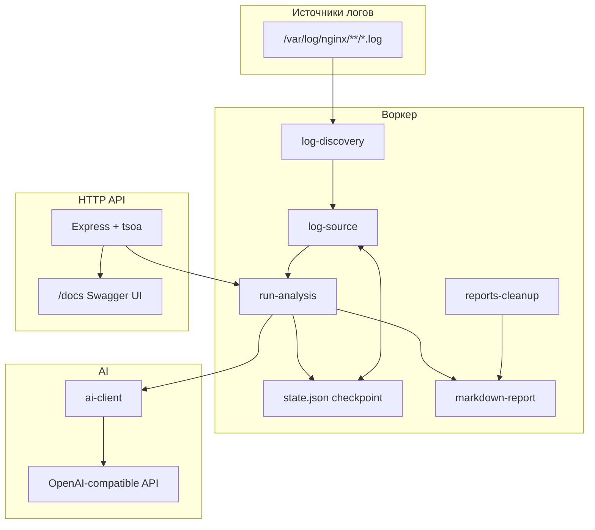

# log-assistant-bot

> **Язык:** [Русский](./README.ru.md) | [English](./README.en.md)

Автоматический **ассистент анализа логов безопасности nginx** на базе OpenAI-совместимого AI API. Бот инкрементально читает новые байты логов с диска, отправляет их на анализ и сохраняет структурированные отчёты в Markdown.

Предназначен для работы на сервере (в том числе в Docker) по расписанию cron или по запросу через CLI/API.

---

## Содержание

1. [Назначение](#назначение)
2. [Архитектура](#архитектура)
3. [Требования](#требования)
4. [Структура проекта](#структура-проекта)
5. [Установка](#установка)
6. [Конфигурация](#конфигурация)
7. [Запуск воркера (CLI)](#запуск-воркера-cli)
8. [Развёртывание в Docker](#развёртывание-в-docker)
9. [HTTP API](#http-api)
10. [Отчёты](#отчёты)
11. [Файлы состояния (checkpoint)](#файлы-состояния-checkpoint)
12. [Интеграция с AI](#интеграция-с-ai)
13. [Лимиты и параллелизм](#лимиты-и-параллелизм)
14. [Безопасность](#безопасность)
15. [Устранение неполадок](#устранение-неполадок)

---

## Назначение

1. **Поиск лог-файлов** — рекурсивный обход `NGINX_LOG_ROOT`, сбор всех `*.log` (включая vhost-каталоги, `archived/` и вложенные папки).
2. **Инкрементальное чтение** — для каждого файла читаются только байты, добавленные с прошлого запуска, по JSON-checkpoint (смещение + inode). При ротации логов (смена inode или уменьшение размера) checkpoint сбрасывается.
3. **Метки строк** — каждая строка получает префикс с относительным путём, например: `[domen.ru/access.log] 1.2.3.4 - - [...]`.
4. **Анализ AI** — сырые строки отправляются в OpenAI-совместимый endpoint `/chat/completions` со строгой JSON-схемой результата.
5. **Сохранение отчёта** — файл Markdown `security-report-<timestamp>.md` в `REPORTS_DIR`; краткая сводка выводится в терминал.
6. **Планировщик** — в режиме по умолчанию анализ запускается сразу при старте и далее по cron (`CRON_SCHEDULE`, по умолчанию каждые 2 часа).
7. **Очистка** — удаление отчётов старше `REPORT_RETENTION_DAYS` (после анализа или по отдельному cron).

### Режимы анализа

| Режим | Флаг CLI | API | Файл checkpoint | Поведение |
|-------|----------|-----|-----------------|-----------|
| **Основной (инкрементальный)** | `--once` / cron по умолчанию | `POST /analyze/once` | `STATE_FILE_PATH` | Только новые байты с прошлого запуска |
| **Away (отдельный инкрементальный)** | `--away` | `POST /analyze/away` | `AWAY_STATE_FILE_PATH` | Та же логика, но отдельный checkpoint — удобно для ручных запусков без влияния на основное расписание |

Оба режима используют один пайплайн (`runOneShotAnalysis`); отличается только файл состояния.

Если новых строк нет, отчёт всё равно создаётся: `suspicious: false`, низкий риск, рекомендация проверить доступ к логам.

---

## Архитектура



### Модули

| Путь | Назначение |
|------|------------|
| `src/core/cli.ts` | Точка входа CLI: `--once`, `--away`, `--cron` (по умолчанию) |
| `src/core/cron.ts` | Планировщик cron, запуск при старте, очистка отчётов |
| `src/core/config.ts` | Загрузка переменных окружения |
| `src/core/api.ts` | Запуск Express API |
| `src/modules/worker/log-discovery.ts` | Рекурсивный поиск `*.log` |
| `src/modules/worker/log-source.ts` | Инкрементальное чтение FS, legacy lookback/Docker |
| `src/modules/worker/state.ts` | Чтение/запись checkpoint (JSON v1) |
| `src/modules/worker/run-analysis.ts` | Оркестрация анализа |
| `src/modules/worker/markdown-report.ts` | Формат Markdown-отчёта |
| `src/modules/worker/terminal-report.ts` | Сводка в консоль |
| `src/modules/worker/reports-cleanup.ts` | Удаление старых отчётов |
| `src/modules/worker/run-mutex.ts` | Глобальная блокировка параллельных запусков |
| `src/modules/ai/ai-client.ts` | Запрос к AI + валидация JSON |
| `src/modules/api/` | REST, парсер отчётов, Swagger (tsoa) |
| `Docker/docker-compose.yml` | Два сервиса: воркер + API |

---

## Требования

- **Node.js** 22+ (в Docker; локально обычно достаточно 20+)
- **npm**
- Права на чтение каталога логов nginx (обычно `/var/log/nginx`)
- **Ключ OpenAI-совместимого API** (`OPEN_AI_KEY`) — OpenAI, AITunnel, локальный прокси и т.д.
- Для Docker: монтирование `/var/log/nginx` с хоста в контейнер (read-only)

---

## Структура проекта

```
log-assistant-bot/
├── src/
│   ├── core/           # CLI, cron, config, точка входа API
│   └── modules/
│       ├── ai/         # Клиент AI
│       ├── api/        # REST API (tsoa + Express)
│       └── worker/     # Сбор логов, анализ, отчёты
├── Docker/
│   ├── docker-compose.yml
│   └── .env.example
├── .env.example
├── README.md           # Краткий старт + ссылки
├── README.ru.md        # Этот файл
└── README.en.md        # Документация на английском
```

---

## Установка

### Локально (без Docker)

```bash
git clone <url-репозитория>
cd log-assistant-bot
cp .env.example .env
# Отредактируйте .env — минимум OPEN_AI_KEY
npm install
```

### Проверка разового запуска

```bash
npm run analyze:once
```

Ожидаемый результат: сводка в терминале (если есть новые логи) и путь к Markdown-отчёту:

```
Markdown report written to: /path/to/security-report-2026-05-24T12-00-00.000Z.md
```

---

## Конфигурация

Все параметры задаются переменными окружения (`dotenv` читает `.env` в корне проекта).

Для локального запуска: `.env.example` → `.env`.  
Для Docker: `Docker/.env.example` → `Docker/.env`.

### AI-провайдер

| Переменная | Обязательна | По умолчанию | Описание |
|------------|-------------|--------------|----------|
| `OPEN_AI_KEY` | **Да** | — | API-ключ |
| `OPEN_AI_BASE_URL` | Нет | `https://api.openai.com/v1` | Базовый URL API |
| `OPEN_AI_MODEL` | Нет | `gpt-4o-mini` | Имя модели |
| `OPEN_AI_TIMEOUT_MS` | Нет | `120000` | Таймаут HTTP-запроса к AI (мс) |

Пример для AITunnel:

```env
OPEN_AI_KEY="ваш-ключ"
OPEN_AI_BASE_URL="https://api.aitunnel.ru/v1/"
OPEN_AI_MODEL="qwen3.5-9b"
OPEN_AI_TIMEOUT_MS=180000
```

### Логи и checkpoint

| Переменная | По умолчанию | Описание |
|------------|--------------|----------|
| `NGINX_LOG_ROOT` | `/var/log/nginx` | Корень для рекурсивного поиска логов |
| `STATE_FILE_PATH` | `<cwd>/.log-assistant.state.json` | Основной checkpoint |
| `AWAY_STATE_FILE_PATH` | `<cwd>/.log-assistant-away.state.json` | Checkpoint для режима away |

### Отчёты

| Переменная | По умолчанию | Описание |
|------------|--------------|----------|
| `REPORTS_DIR` | Корень проекта (`process.cwd()`) | Каталог для `*.md` |
| `REPORT_PREFIX` | `security-report` | Префикс имени: `{prefix}-{ISO-время}.md` |
| `REPORT_RETENTION_DAYS` | `30` | Удалять отчёты старше N дней |
| `REPORT_CLEANUP_CRON` | *(пусто)* | Отдельный cron для очистки; если пусто — очистка после каждого анализа по расписанию |

### Расписание

| Переменная | По умолчанию | Описание |
|------------|--------------|----------|
| `CRON_SCHEDULE` | `0 */2 * * *` | Cron (каждые 2 часа в 0-ю минуту) |

Синтаксис [node-cron](https://www.npmjs.com/package/node-cron) (стандартные 5 полей).

### Лимиты объёма (на один запуск)

| Переменная | По умолчанию | Описание |
|------------|--------------|----------|
| `MAX_LOG_LINES_PER_RUN` | `1000` | Макс. строк для AI (при превышении — последние) |
| `MAX_LOG_BYTES_PER_RUN` | `2000000` | Макс. байт чтения по всем файлам за запуск |

### HTTP API

| Переменная | По умолчанию | Описание |
|------------|--------------|----------|
| `API_HOST` | `0.0.0.0` | Адрес прослушивания |
| `API_PORT` | `3010` | Порт |

### Устаревшие (обратная совместимость)

Не используются основным инкрементальным пайплайном:

| Переменная | По умолчанию | Описание |
|------------|--------------|----------|
| `NGINX_LOG_FILE_PATH` | `/var/log/nginx/access.log` | Один файл, режим lookback |
| `NGINX_LOOKBACK_HOURS` | `2` | Окно lookback для legacy-коллекторов |

Функции `collectRecentNginxLogs` и `collectRecentNginxLogsFromDocker` в `log-source.ts` по-прежнему доступны для программного использования.

---

## Запуск воркера (CLI)

| Команда | Описание |
|---------|----------|
| `npm start` | **Cron по умолчанию** — сразу при старте, затем по `CRON_SCHEDULE` |
| `npm run analyze:once` | Разовый инкрементальный анализ (основной checkpoint) |
| `npm run analyze:away` | Разовый анализ с away-checkpoint |
| `npm run analyze:cron` | Явный cron-режим (как `npm start`) |
| `npm run api` | Генерация OpenAPI + запуск API |
| `npm run build` | Компиляция TypeScript |

### Поведение cron

1. При старте — немедленный анализ.
2. По расписанию `CRON_SCHEDULE`.
3. Очистка: после анализа или по `REPORT_CLEANUP_CRON`.
4. Процесс не завершается (удобно для Docker с `restart: unless-stopped`).

Параллельные запуски блокируются глобальным mutex в процессе.

---

## Развёртывание в Docker

Два сервиса в `Docker/docker-compose.yml`:

| Сервис | Команда | Порт | Роль |
|--------|---------|------|------|
| `log-assistant-bot` | `npm start` | — | Воркер по cron |
| `log-assistant-api` | `npm run api` | `3010:3010` | REST API + Swagger |

### Запуск

```bash
cp Docker/.env.example Docker/.env
# Укажите OPEN_AI_KEY в Docker/.env

docker compose -f Docker/docker-compose.yml up -d
```

### Тома

- `..:/app` — корень проекта (код, отчёты, checkpoint)
- `/var/log/nginx:/var/log/nginx:ro` — логи nginx только для чтения
- `log_assistant_node_modules` — именованный том для `node_modules`

### Что нужно сохранять между перезапусками

- `STATE_FILE_PATH` → по умолчанию `/app/.log-assistant.state.json`
- `AWAY_STATE_FILE_PATH` → `/app/.log-assistant-away.state.json`
- `REPORTS_DIR` → `/app` (файлы `*.md`)

Без постоянного тома checkpoint и отчёты теряются при пересоздании контейнера.

### Переопределения в compose

```yaml
NGINX_LOG_ROOT: /var/log/nginx
STATE_FILE_PATH: /app/.log-assistant.state.json
REPORTS_DIR: /app
API_HOST: 0.0.0.0
API_PORT: 3010
```

Остальное — из `Docker/.env`.

---

## HTTP API

Локальный запуск:

```bash
npm run api
```

- Базовый URL: `http://localhost:3010`
- Swagger UI: `http://localhost:3010/docs`
- Спецификация: `src/modules/api/generated/openapi.json`

**Аутентификация не реализована** — в продакшене ограничивайте доступ файрволом, reverse proxy или VPN.

### Эндпоинты

#### `GET /health`

Проверка работоспособности.

```json
{ "ok": true }
```

#### `GET /docs`

Swagger UI (интерактивная документация).

#### `GET /reports`

Список отчётов (сначала новые).

```json
{
  "reports": [
    {
      "name": "security-report-2026-05-24T10-00-00.000Z.md",
      "path": "/app/security-report-2026-05-24T10-00-00.000Z.md"
    }
  ]
}
```

#### `GET /reports/latest`

Последний отчёт в виде JSON.

```json
{
  "path": "/app/security-report-....md",
  "report": {
    "windowStart": "2026-05-24T08:00:00.000Z",
    "windowEnd": "2026-05-24T10:00:00.000Z",
    "suspicious": true,
    "riskLevel": "high",
    "summary": "...",
    "findings": [...],
    "recommendedActions": [...]
  }
}
```

#### `GET /reports/{fileName}`

Конкретный отчёт по имени файла. Имя: `^[A-Za-z0-9._-]+\.md$`, префикс `REPORT_PREFIX`.

#### `DELETE /reports/{fileName}`

Удаление отчёта. Сбрасывает `lastReportPath` в state, если он указывал на этот файл.

```json
{ "deleted": true, "path": "/app/security-report-....md" }
```

#### `POST /analyze/once`

Запуск основного инкрементального анализа. Возвращает JSON последнего отчёта.

#### `POST /analyze/away`

Запуск анализа с away-checkpoint.

**Успешный ответ:**

```json
{
  "path": "/app/security-report-....md",
  "report": { ... }
}
```

### Коды ошибок

| HTTP | Код `error` | Когда |
|------|-------------|-------|
| 400 | `invalid_report_name` | Некорректное имя файла |
| 404 | `no_reports_found` | Отчётов нет |
| 404 | `not_found` | Файл не найден |
| 409 | `analysis_already_running` | Уже выполняется другой анализ |
| 500 | `internal_error` | Внутренняя ошибка |

Пример:

```json
{
  "error": "analysis_already_running",
  "message": "analysis already running"
}
```

---

## Отчёты

### Имя файла

```
{REPORT_PREFIX}-{ISO-время-с-заменой-двоеточий}.md
```

Пример: `security-report-2026-05-24T14-30-00.000Z.md`

### Структура Markdown

```markdown
# nginx security report
window: 2026-05-24T12:00:00.000Z -> 2026-05-24T14:00:00.000Z
files: 3/11 updated, bytes_read=45231, lines=280 (dropped=0)
suspicious: yes, risk_level: high

Текст summary от AI...

1. [high] Тип находки: Описание | evidence: строка1 | строка2
2. [critical] ...

recommended_actions:
1. Действие один
2. Действие два
```

При первом запуске в `window` вместо начальной метки времени — `first-run`.

API парсит Markdown обратно в JSON (`report-parser.ts`).

### Вывод в терминал

При наличии логов печатается читаемая сводка:

```
=== NGINX SECURITY ANALYSIS ===
SUSPICIOUS ACTIVITY: YES/NO
RISK LEVEL: HIGH
...
```

---

## Файлы состояния (checkpoint)

Формат: JSON v1 (`state.ts`).

```json
{
  "version": 1,
  "lastRunAt": "2026-05-24T14:00:00.000Z",
  "lastReportPath": "/app/security-report-....md",
  "files": [
    {
      "path": "/var/log/nginx/access.log",
      "inode": 123456,
      "offset": 1048576,
      "leftoverBytes": 0,
      "lastReadAt": "2026-05-24T14:00:00.000Z"
    }
  ]
}
```

### Когда checkpoint сбрасывается

Для файла смещение обнуляется, если:

- файл виден впервые;
- **изменился inode** (ротация);
- **размер файла < сохранённого offset** (усечение).

Неполные строки на границе чанка хранятся в `leftover` и дополняются при следующем чтении.

---

## Интеграция с AI

- Endpoint: `POST {OPEN_AI_BASE_URL}/chat/completions`
- Формат ответа: `json_schema`, схема `services_security_report`
- Системный промпт: анализатор логов безопасности nginx (на русском)
- Валидация ответа через **Zod**

### Логическая схема отчёта

```typescript
{
  suspicious: boolean;
  riskLevel: "low" | "medium" | "high" | "critical";
  summary: string;
  findings: Array<{
    type: string;
    severity: "low" | "medium" | "high" | "critical";
    details: string;
    evidence: string[];
  }>;
  recommendedActions: string[];
}
```

AI ищет, в частности: сканирование уязвимостей, path traversal, попытки RCE, обращения к `.env` и чувствительным путям, подозрительные User-Agent, аномалии протокола и т.д.

---

## Лимиты и параллелизм

- **Строки**: при превышении `MAX_LOG_LINES_PER_RUN` в AI уходят **последние** строки.
- **Байты**: чтение останавливается при исчерпании `MAX_LOG_BYTES_PER_RUN` (файлы в порядке сортировки путей).
- **Mutex**: cron, CLI и API используют одну блокировку — параллельный запрос → HTTP 409.
- **Пустые логи**: вызов AI не выполняется; создаётся отчёт-заглушка с низким риском.

---

## Безопасность

1. **API без аутентификации** — не публикуйте порт `3010` в интернет без защиты.
2. **Логи только для чтения** в Docker (`:ro`) — бот не изменяет логи nginx.
3. **Секреты в `.env`** — не коммитьте `.env` и `Docker/.env` (в `.gitignore`).
4. **Содержимое логов уходит в сторонний AI** — учитывайте политику данных; возможен self-hosted LLM.
5. **Имена отчётов** проверяются на path traversal (`..` запрещён).

---

## Устранение неполадок

| Проблема | Возможная причина | Решение |
|----------|-------------------|---------|
| `AI provider is required` | Нет `OPEN_AI_KEY` | Задайте ключ в `.env` |
| `AI provider request failed` | Неверный URL/модель/ключ или таймаут | Проверьте `OPEN_AI_*`, увеличьте `OPEN_AI_TIMEOUT_MS` |
| Нет новых строк | Нет записи в логи или нет прав | Проверьте `NGINX_LOG_ROOT`, права, что nginx пишет логи |
| Отчёты не сохраняются в Docker | Эфемерная ФС контейнера | Смонтируйте каталог как в `docker-compose.yml` |
| Анализ пропущен (409) | Параллельный запуск | Дождитесь завершения текущего |
| Повторное чтение старых данных | Удалён state | Ожидаемо при первом запуске; сброс inode/size тоже читает с начала |
| API 404 на `/reports/latest` | Отчётов ещё нет | Сначала `npm run analyze:once` |

### Полезные команды

```bash
# Разовый анализ
npm run analyze:once

# Health API
curl http://localhost:3010/health

# Анализ через API
curl -X POST http://localhost:3010/analyze/once

# Список отчётов
curl http://localhost:3010/reports
```

---

## Лицензия

См. [LICENSE](./LICENSE).
